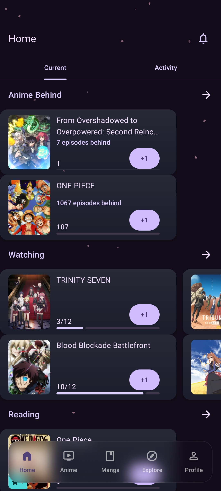
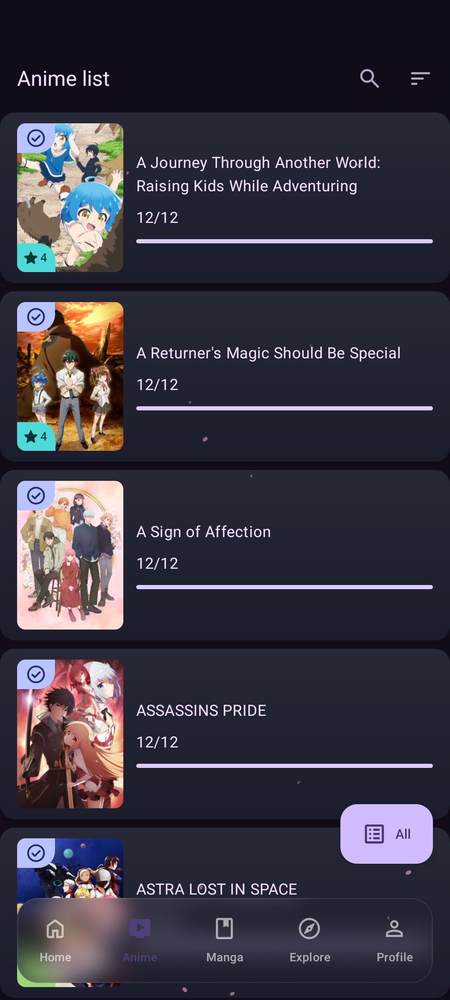
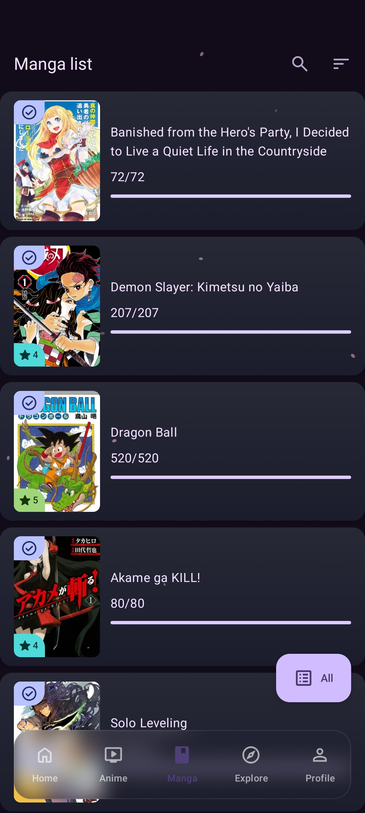
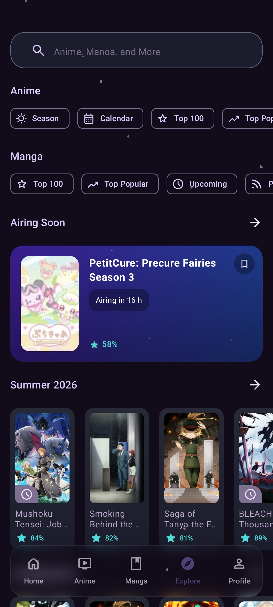
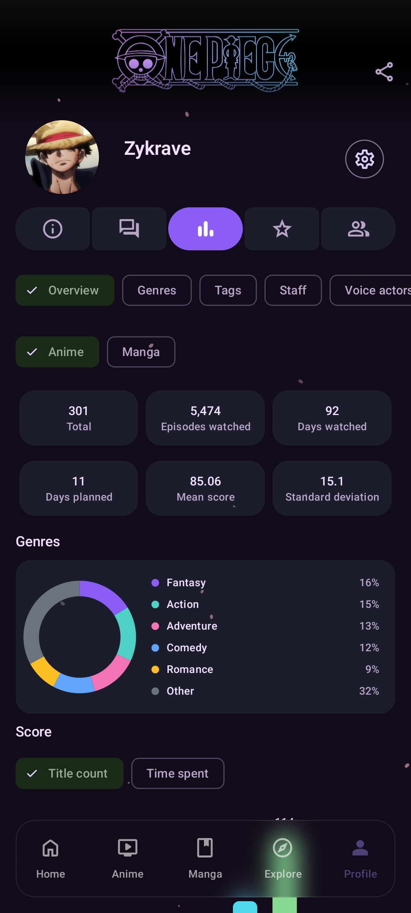
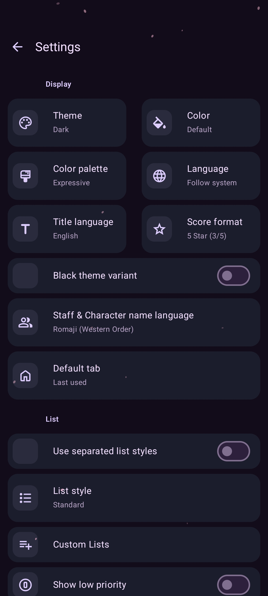

  

<h1 align="center">Anirumy</h1>

  <b>An unofficial AniList client for Android — track your anime and manga, the modern way.</b>

  
  
  

  

---

## About

Anirumy is an **unofficial third-party client for [AniList](https://anilist.co)**, built natively for Android. It's not affiliated with AniList — just a fast, clean way to manage your anime and manga lists without opening a browser.

## ✨ Why Anirumy

- **Unofficial AniList client** — built specifically around AniList's API, not a generic tracker.
- **Modern UI** — clean, native Material-style design, not a reskinned web view.
- **Easy to use** — straightforward navigation, nothing bloated or cluttered.
- **AniList sync** — log in with your AniList account and keep your list synced in real time.
- **And more** — actively maintained with more features on the way.

## 📱 Screenshots

<table>
  <tr>
    <td></td>
    <td></td>
    <td></td>
  </tr>
  <tr>
    <td></td>
    <td></td>
    <td></td>
  </tr>
</table>

## 📥 Installation

### 1. Download the APK

Grab the latest `app-foss-release.apk` from the [Releases](../../releases) page.

### 2. Allow installs from this source

Since Anirumy isn't distributed through the Play Store, your phone will ask for permission the first time you install an APK from outside the store:

- Tap the downloaded APK file
- If prompted, tap **Settings**, then enable **"Allow from this source"** for your browser or file manager
- Go back and tap **Install**

### 3. About the Google Play Protect warning

You will very likely see a screen from **Google Play Protect** during installation that says something like:

> *"Unsafe app blocked"* or *"App isn't verified"* or *"This app wasn't scanned for harmful behavior"*

**This is expected and normal.** It happens for every app distributed outside the Play Store, regardless of how safe or well-built it is — it is not specific to Anirumy. Google Play Protect flags any APK it hasn't independently reviewed through its Play Store pipeline.

Anirumy is fully open source — every line of code in this repository is public, so you (or anyone) can verify exactly what the app does before installing.

If you see this warning and want to proceed anyway:

- Tap **More details** (or similar, wording varies by Android version)
- Tap **Install anyway**

If you're not comfortable bypassing that warning, that's completely reasonable too — you're welcome to review the source code yourself first, or wait until/if the app becomes available through F-Droid or a similar verified channel.

## 🙏 Credits & License

Anirumy is a derivative work built on top of open-source AniList client projects, most notably [AniHyou-android by axiel7](https://github.com/axiel7/AniHyou-android).

This project is licensed under the **GNU General Public License v3.0 (GPLv3)** — the same license as its upstream project. See the [LICENSE](LICENSE) file for full terms.

As required by GPLv3, the full source code of Anirumy is available in this repository.

## ⚠️ Disclaimer

Anirumy is not affiliated with, endorsed by, or connected to AniList in any way. It's an independent, community-built client.

---

Made by <a href="https://github.com/Zykrave">Zykrave</a>

---
